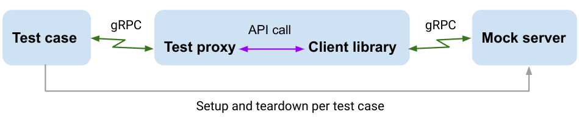

# Test Framework for Cloud Bigtable Client Libraries

This repository contains the test framework to validate the correctness of Cloud Bigtable
[client libraries](https://cloud.google.com/bigtable/docs/reference/libraries).
Specifically, all of the client libraries should exhibit correct and
consistent behaviors when interacting with the server (e.g. retry on transient error)
However, writing test cases in every language would present maintainability and scalability challenges.

This framework allows test logic to be written once and run for any client implementation.
The tests can be run on different operating systems, but the examples in this document
assume you are using Linux.

## The Framework

The test framework consists of three components: test cases, test proxy, and mock server.
With the client library involved, we use the diagram below to illustrate the life of a test case.

<p align="center">

</p>


The test case first starts a mock server, then sends a test request through the test proxy,
and tears down the mock server after finish.

The test proxy exposes the client API via an RPC service: it translates the
request from the test case into an API call to the client library, and the
return values of the client library are assembled by the test proxy into a
response to the test case. As the proxy runs in a separate process and
communicates with the test program via gRPC, different languages of the client
library are supported.

This [doc](docs/test_proxy.md) describes how to implement a test proxy.
Please use the doc if you want to onboard a Cloud Bigtable client library.

## Test Execution

### Basic usage

Assuming you have built the proxy binary already, then you can do the following:

1. Install Golang ([Instructions](https://go.dev/doc/install))
1. Set environment variable if you don't have gcc installed

   ```sh
   $ export CGO_ENABLED="0"
   ```
1. Download the test code

   ```sh
   $ git clone https://github.com/googleapis/cloud-bigtable-clients-test.git
   ```
1. Bring up the test proxy with an unused port. Java example:

   ```sh
   $ mvn exec:java -Dexec.mainClass=com.google.cloud.bigtable.testproxy.CbtTestProxyMain -Dport=9999
   ```
1. Change directory to the folder [*tests*](tests/),
   and do

   ```sh
   $ go test -v -proxy_addr=:9999
   ```
   To run tests that use a local Bigtable emulator, the command is

   ```sh
   $ go test -v --tags=emulator -proxy_addr=:9999
   ```

### Advanced usage

You may want to skip some test cases which are not yet applicable to your client library.
As Golang only allows us to select the test cases to run, we provide a
[naming convention](docs/test_case_naming.md) to facilitate test skipping.
Update: `-skip` will be supported
([feature request](https://github.com/golang/go/issues/41583)).

The command is

```sh
$ go test -v -run <test name regex> -proxy_addr=:9999
```

In the above command, `<test name regex>` will select the test cases that have partially matching names.
For more information, please refer to the [online doc](https://pkg.go.dev/cmd/go/internal/test).
Here are some useful examples:

* `TestReadRows_` selects all the test cases exercising “ReadRows”.
* `TestReadRows_Retry_` selects all the test cases exercising the “Retry” behaviors of “ReadRows”.
* `_Retry_` selects all the test cases that contain “\_Retry\_” in the names.
* `_NoRetry_\|_Generic_` selects all the test cases that contain “\_NoRetry\_” or “\_Generic\_”  in the names.
* A full name can be used to only run the specific test case (good for troubleshooting).

## Troubleshooting Tips

If you experience a test failure, the printout of the error may already provide hints for failure resolving.
In addition, you can use logging to uncover less obvious problems. The subsections below provide some recommendations.

### Logging in the test case

You can use `t.Logf()` to print out the variables you care about. For example, to check the response of test proxy, you can do

```go
t.Logf("Response of test proxy: %+v", res)
```

### Logging in the mock server

We have added flag-guarded logging to print out the requests from the client library. To enable it, please use

```sh
$ go test -v -run <test name> -proxy_addr=:9999 -print_client_req
```

### Logging in the test proxy

To check if the test proxy receives the expected request from the test case, you can print it out at the proxy method’s entry point.
Java example:

```java
logger.info("Request from test:\n" + request.toString());
```

To check if the test proxy receives the expected return value from the client library, you can print it out right after the client method call.
Java example:

```java
row = client.dataClient().readRow(...);
logger.info("readRow() returns:\n" + row.toString());
```

### Logging in the client library

You may add logging to the client library to check if it receives the expected parameters from the proxy or responses from the server.

### Additional tips

* At the end of a test case, the client object will be deleted. So please make sure the proxy method `RemoveClient()` is implemented correctly.
* If you terminate the running test via “Ctrl+C”, you will leave behind the client objects, which will lead to collision of client IDs in the resumed execution.
  In this case, you need to restart the test proxy server to have a clean state.
* If you have additional questions or issues, please file [issues](https://github.com/googleapis/cloud-bigtable-clients-test/issues).

